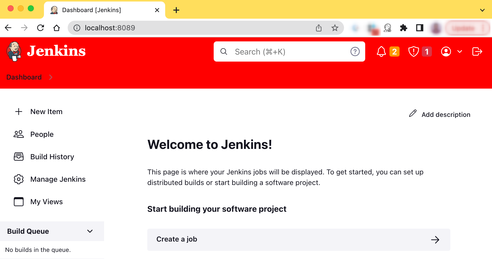
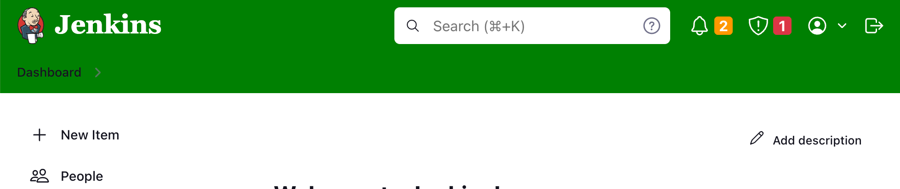
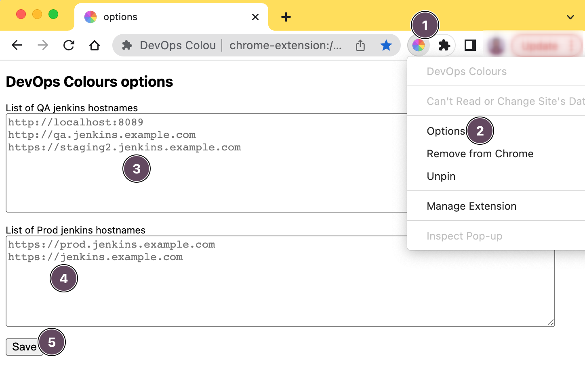

#  DevOps Colours  
><i>A `Chrome Extension` to visually differentiate between `QA` and `Prod` based on `url pattern`</i>.

Top banner will be automatically changed to `Green`(QA) or `Red`(Production urls). 

Supported DevOps server technologies:
- [Jenkins](https://www.jenkins.io/) 
- [AWS](https://aws.amazon.com/) - TODO

## Extension in action

## Installation
[Install](https://chrome.google.com/webstore/detail/devops-colours/jdfcifmjkfkjjaihgmodbmjhdbkcipfl) `devOps Colours` from chrome webstore

## Configuration

Goto `extension options` page

## Motivation
- [AWS Region Color Highlights](https://chrome.google.com/webstore/detail/aws-region-color-highligh/kdjchigefmkankimfkgolpfincgbffkg?hl=en)
- [AWS Colours](https://chrome.google.com/webstore/detail/aws-colours/pafgadpbmhggcdcncekcjllcaancmeej?hl=en)
- [AWS Extend Switch Roles](https://chrome.google.com/webstore/detail/aws-extend-switch-roles/jpmkfafbacpgapdghgdpembnojdlgkdl?hl=en)

## Resources

+ [chrome-extensions-samples](https://github.com/GoogleChrome/chrome-extensions-samples/tree/main)
+ [chrome-extension-template](https://github.com/ClydeDz/chrome-extension-template)

### License

[MIT License](LICENSE)

### Privacy
[Privacy policy](docs/PRIVACY.md)
